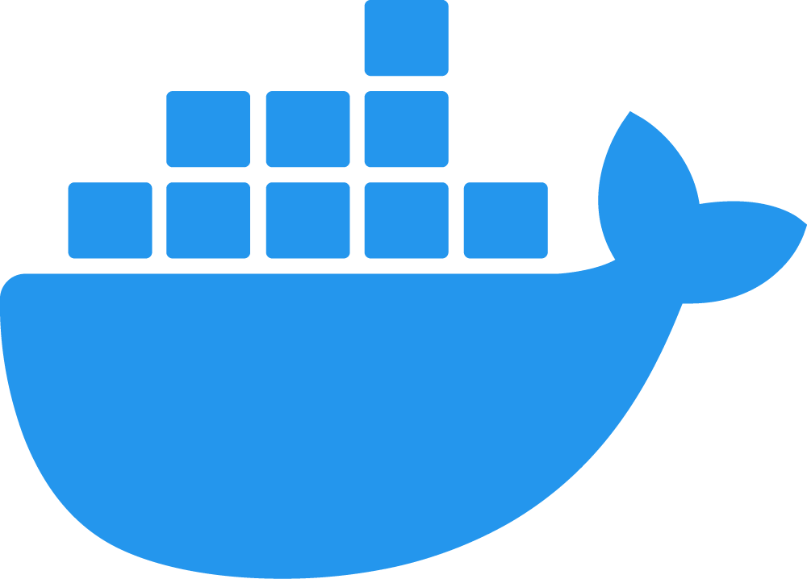
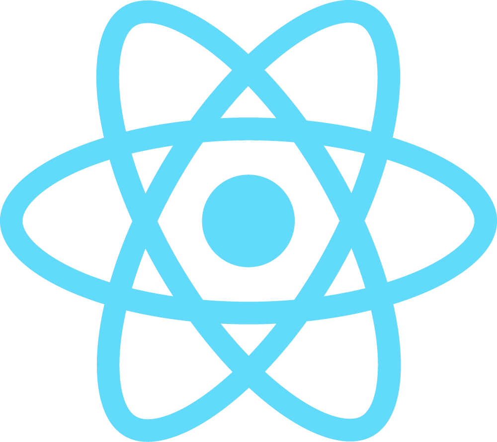
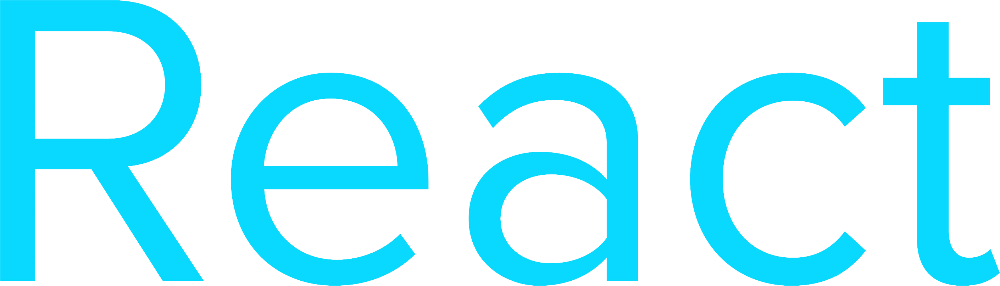
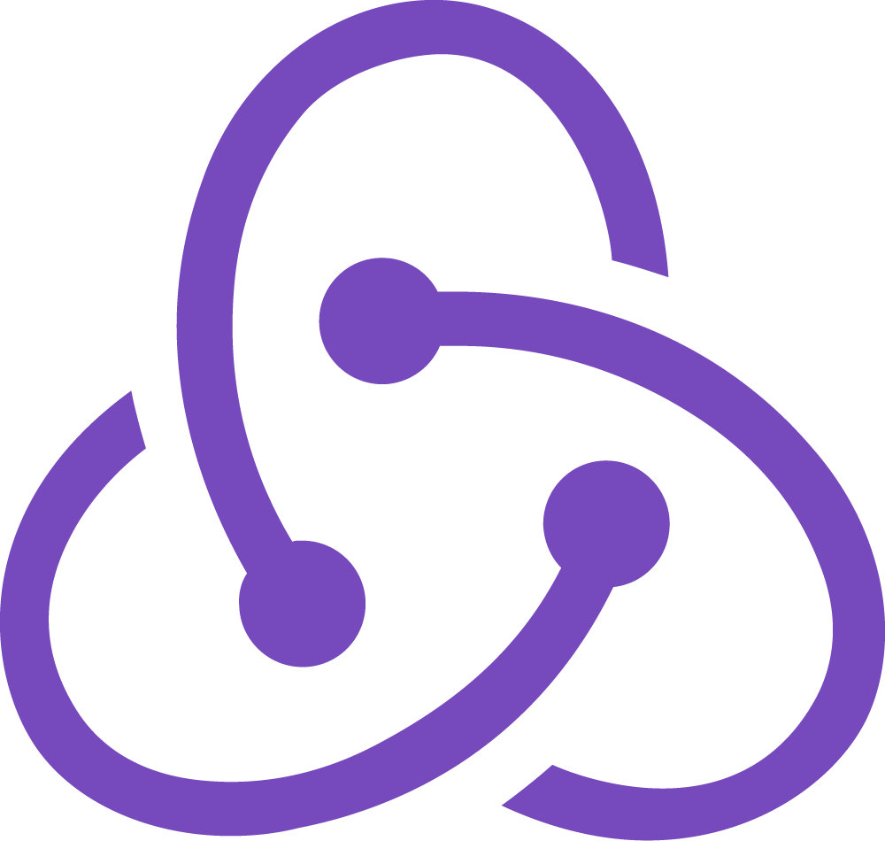

# Template full stack application
## Description
Form | Side | Stack | Language | Path
---|---|---|---|---
API | Back-end | Flask | Python | ``` api/ ```
Web app | Front-end | React | JavaScript | ``` web/ ```
iOS | Front-end | React Native | JavaScript | planned
Android | Front-end | React Native | JavaScript | planned

### Stack
<table>
	<thead>
		<tr>
			<th>Side</th>
			<th>Logo</th>
			<th>Technology</th>
		</tr>
	</thead>
	<tbody>
		<tr>
			<td rowspan="2">DevOps</td>
			<td></td>
			<td></td>
		</tr>
		<tr>
			<td></td>
			<td></td>
		</tr>
		<tr>
			<td rowspan="2">Back-end</td>
			<td></td>
			<td></td>
		</tr>
		<tr>
			<td></td>
			<td></td>
		</tr>
		<tr>
			<td rowspan="4">Front-end</td>
			<td></td>
			<td></td>
		</tr>
		<tr>
			<td></td>
			<td></td>
		</tr>
		<tr>
			<td></td>
			<td></td>
		</tr>
		<tr>
			<td></td>
			<td></td>
		</tr>
	</tbody>
</table>

## Install & Use with Docker
1. Customize files ``` api/keys.json ``` & ``` docker/.env ```

2. Run Docker Compose
```
cd docker/
docker-compose up --build
```

3. Open
Go to ``` http://localhost/ ```

## Install
### Back-end
1. Change folder
```
cd api/
```

2. Customize files ``` sets.py ``` & ``` keys.json ```

3. Virtual environment
```
python3 -m venv env
env/bin/pip install -r requirements.txt
```

### Front-end
1. Change folder
```
cd web/
```

2. Customize files ``` src/sets.js ``` & ``` src/keys.js ```

3. Virtual environment
```
npm install
```

OR

```
npm run build
```

## Usage
### Back-end
```
env/bin/gunicorn app:app -k eventlet -w 1 -b :5000 --reload
```

### Front-end
```
npm start
```

OR

```
serve -s build -p 3000
```